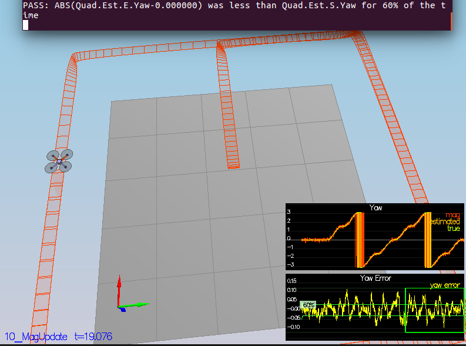

# Estimation Project #
### Writeup of project 4 of Flying Car Nanodegree ###

This is the last project of term 1 and we use an Extended Kalman Filter (EKF) to estimate our current drone state (position, velocity, yaw). Here we especially have to consider sensor data and their noise. The implementation is done in C++ and based on https://github.com/udacity/FCND-Estimation-CPP.

## The Tasks ##

Here are the steps to build up the EKF estimator:

 - [Step 1: Sensor Noise](#step-1-sensor-noise)
 - [Step 2: Attitude Estimation](#step-2-attitude-estimation)
 - [Step 3: Prediction Step](#step-3-prediction-step)
 - [Step 4: Magnetometer Update](#step-4-magnetometer-update)
 - [Step 5: Closed Loop + GPS Update](#step-5-closed-loop--gps-update)
 - [Step 6: Adding Your Controller](#step-6-adding-your-controller)


### Step 1: Sensor Noise ###

Until now none of the sensors had any noise. The first step to adding additional realism to the problem, and developing an estimator, is adding noise to the quad's sensors. When running scenario 6 the GPS X position and the accelerometer's x measurment are recorded to csv files. In [./visualization/6_Sensor_Noise.iypnb](./visualization/6_Sensor_Noise.iypnb) the standard deviation is calculated and these values are plugged in  `./config/6_Sensornoise.txt`.

```
GPS standard deviation in x direction: 0.7010171369141591
IMU acceleration standard deviation in x direction: 0.4919424755126765
```

### Step 2: Attitude Estimation ###

The complementary filter implemented in `UpdateFromIMU()` uses a linear approach to estimate the drone's attitude. The accelerometer estimates roll and pitch in global frame but the velocities from the gyro are in the body frame. If we assume the angles are small, the turn rates measured by the gyro in the body frame approximate the global turn rates. As we can see in scenario 7 there is some error using this approach. 
A nonlinear complementary filter improves this, therefore we use a quaternion like in section 7.1.2 of [Estimation for Quadrotors](https://www.overleaf.com/read/vymfngphcccj) for the Euler angles and integrate the body rates from the gyro to get a predicted quaternion for pitch/roll/yaw.

```c++
// The Quaternion<float> class has a handy FromEuler123_RPY function for creating a quaternion from Euler Roll/PitchYaw
Quaternion<float> q = Quaternion<float>::FromEuler123_RPY(rollEst, pitchEst, ekfState(6));
// Quaternion<float> also has a IntegrateBodyRate function, though this uses quaternions, not Euler angles 
q.IntegrateBodyRate(gyro, dtIMU);
```


In the screenshot above the attitude estimation using linear scheme (left) and using the improved nonlinear scheme (right). Note that Y axis on error is much greater on left.


### Step 3: Prediction Step ###

1. Scenario 8 is configured to use a perfect IMU (only an IMU), but without the prediction step the drone is not able to follow the desired state.

2. In `QuadEstimatorEKF.cpp` the function `PredictState()` calculates the current state forward by time `dt` using current acceleration and body rates. The estimator state track the actual state, with only reasonably slow drift, as shown in the figure below:


3. The scenario `09_PredictionCov` introduces realistic IMU with some noise. You will see a small fleet of quadcopter all using your prediction code to integrate forward. The estimated covariance (white bounds) currently do not capture the growing errors.

4. In `QuadEstimatorEKF.cpp` the partial derivative of the body-to-global rotation matrix is calculated in the function `GetRbgPrime()` like this:

This matrix is then used as part of the Jacobian Matrix `gPrime` to predict the covariance.


5. Tuned the `QPosXYStd` and the `QVelXYStd` process parameters in `QuadEstimatorEKF.txt` to try to capture the magnitude of the error you see.


Looking at this result, you can see that in the first part of the plot, our covariance (the white line) grows very much like the data.

### Step 4: Magnetometer Update ###

Now we come to the update step of the EKF and we use the magnetometer to estimate the vehicle's heading.

1. In scenario `10_MagUpdate` a realistic IMU is used, but the magnetometer update hasn’t been implemented yet. As a result, you will notice that the estimate yaw is drifting away from the real value (and the estimated standard deviation is also increasing).  

2. Tuned the parameter `QYawStd` (`QuadEstimatorEKF.txt`) for the QuadEstimatorEKF so that it approximately captures the magnitude of the drift, as demonstrated here:

3. Implement magnetometer update in the function `UpdateFromMag()` described in section 7.1.3 of [Estimation for Quadrotors](https://www.overleaf.com/read/vymfngphcccj). The results are here:




### Step 5: Closed Loop + GPS Update (scenario 11) ###
Now we use the GPS sensor to update our state further, this means our position and velocity. 

1. Run scenario `11_GPSUpdate`.  At the moment this scenario is using both an ideal estimator and and ideal IMU.  Even with these ideal elements, there are position and velocity errors (bottom right). As you see they are drifting away, since GPS update is not yet implemented.

2. Let's change to using your estimator by setting `Quad.UseIdealEstimator` to 0 in `config/11_GPSUpdate.txt`. The drone goes wild no and there doesn't seem to be any given path.

3. Now repeat with realistic IMU by commenting out these lines in `config/11_GPSUpdate.txt`:
```
#SimIMU.AccelStd = 0,0,0
#SimIMU.GyroStd = 0,0,0
```

4. Tuned the process noise model in `QuadEstimatorEKF.txt` to try to approximately capture the error you see with the estimated uncertainty (standard deviation) of the filter.

5. Implement the EKF GPS Update in the function `UpdateFromGPS()` described in section 7.1.2 of [Estimation for Quadrotors](https://www.overleaf.com/read/vymfngphcccj). Although there is still some position/velocity error the copter is following the desired path and the test passes.


### Step 6: Adding Your Controller ###

Up to this point, we have been working with a controller that has been relaxed to work with an estimated state instead of a real state.  So now, you will see how well your controller performs and de-tune your controller accordingly.

1. Replaced `QuadController.cpp` and `QuadControlParams.txt` with the controller you wrote in the last project.

3. Run scenario `11_GPSUpdate`. If your controller crashes immediately do not panic. Flying from an estimated state (even with ideal sensors) is very different from flying with ideal pose. You may need to de-tune your controller. Decrease the position and velocity gains (we’ve seen about 30% detuning being effective) to stabilize it.  Your goal is to once again complete the entire simulation cycle with an estimated position error of < 1m.


## References ##

- Thanks to Fotokite for the initial development of the project code and simulator.
- Udacity Flying Car Nanodegree
- [Estimation for Quadrotors](https://www.overleaf.com/read/vymfngphcccj)